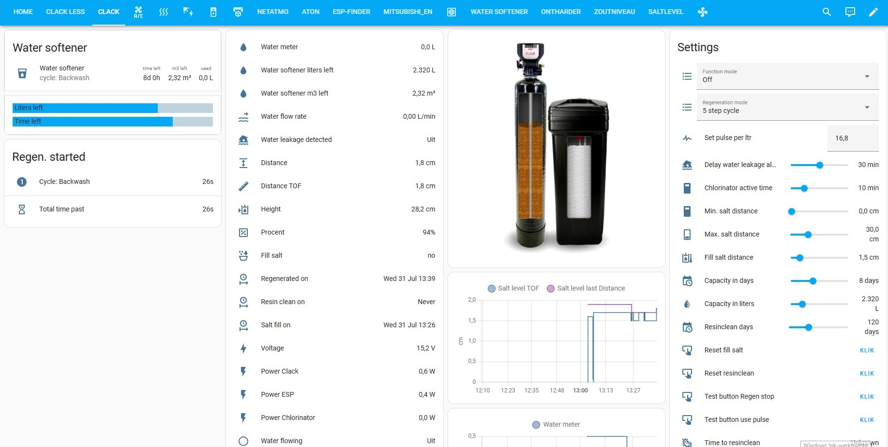

# Clack reader V4 met Atom S3 lite en TOF sensor

## Hardware
The PCB includes:
- The [Atom S3 lite](https://www.tinytronics.nl/shop/nl/development-boards/microcontroller-boards/met-wi-fi/m5stack-atom-s3-lite-esp32-s3-development-board) from M5stack
- The [TOF1 sensor](https://www.tinytronics.nl/shop/nl/platformen-en-systemen/m5stack/unit/m5stack-tof-unit)  (vl53l0x) or [TOF2 sensor](https://shop.m5stack.com/products/time-of-flight-distance-unit-vl53l1x) (vl53l1x) from M5stack
- TOF1 can measure with a groove cable up to 5 meters (2x 2m + 1x 1m with connector blocks)
- TOF2 can measure with a groove cable up to 3 meters (1x 2m + 1x 1m with connector blocks)
- [3D printed](../readme/clack_tof-holder.stl)  TOF sensor housing, which can be attached with two stainless steel M4 bolts and nuts on the salt reservoir lid.

Here you can find the location where the Clack Reader is best mounted inside the housing:
[Photo1](../readme/mount_position_image1.jpg) [Photo2](../readme/mount_position_image2.jpg)

Here is a [PDF](../readme/Clack_reader_v4_connections_on_clack_ws1.pdf) with an overview of the connections.

The PCB also has connections on the back to loop the clack flow meter with the supplied cable and a connector to attach the DP-SW (2-pin Molex connector).
The DP-SW can then be used to give the softener a delayed or immediate regeneration, or prevent it. This depends on the settings in the softener control itself (refer to the manual).

## Software
Everything is programmed in ESPHOME.
Enter your own Wi-Fi details via the Wi-Fi hotspot with the password: configesp.

## Lovelace menu
To fully utilize the Lovelace menu with the salt level simulation as shown below in the dashboard, you need to create a folder /www/images in your Home Assistant directory.
Copy all the simulation images from /www/images into it.

Example: [/www/images](../www/images)

Example dashboard: 


You can add the dashboard via Home Assistant by going to the three dots - edit dashboard - raw configuration editor.
Add the text from, for example, [lovelace_menu_Post_fill_with_2nd_backwash_dn_brine_EN.yaml](../home_assistant/lovelace_menu_Post_fill_with_2nd_backwash_dn_brine_EN.yaml) and save it.
You will now have an extra Clack menu in Home Assistant.

To properly view the status bar, you can install a frontend application via HACS, such as bar-card, multiple-entity-row and card-mod.


## Automations
It is possible to receive a notification on a phone running the Home Assistant app, for example, in case of a water leak or when salt runs out.
Be sure to change the entity of your own device in the code.

Merge [clack_en.yaml](../homeassistant/clack_en.yaml) with automations.yaml (pay attention to indentations) or preferably:

### File on your own location:
Place [clack_en.yaml](../homeassistant/clack_en.yaml) at your own location and adjust configuration.yaml to:

```yml
homeassistant:
  packages: !include_dir_named packages
```

Then create a /packages directory in /config and copy automation_saltalarm_nl.yaml into it.
Restart Home Assistant.

## Explanation operation

Use the sliders to set the correct heights.
An example of the minimum and maximum height can be found [here.](../readme/min_max_EN.jpg)

Salt refill distance is the distance from which an alarm (automation) will be sent (the refill value will become "yes").
This is measured from the bottom of the tank, so from the maximum distance upwards.

Since many water softeners have water above the salt (small salt reservoir), there is a smart function built into the distance measurement.
The sensor measures the distance downwards. The distance to be measured only increases as the salt runs out.
Shorter distances are not recorded as the last value, only longer ones. This way, water above the salt does not affect the measurement.

There are two readings: Distance and TOF Distance.
Distance is the measurement with the smart function. TOF Distance continuously measures every 10 seconds but has no effect on the percentage scale or last measured distance (only when the distance is greater)


### Refilling Salt

In the dashboard, there are several buttons with various functions.
The button "Reset salt refilled" will equalize the TOF distance and distance, thereby resetting the distance measurement so that the new salt level can be measured and recorded again.
